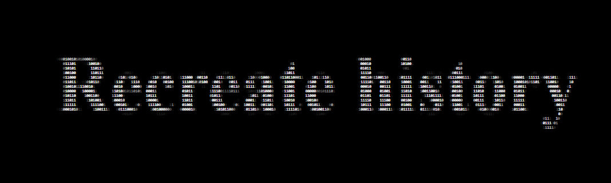

### `ASCII Busts` is a creative collective and experimental digital art project exploring the intersection of history, minimalism, and web-punk aesthetics through ASCII art.

## Who We Are
**We are a group of artists, developers, and crypto-enthusiasts passionate about digital expression, historical symbolism, and the power of text-based art. Our work blends ancient wisdom with modern tech, turning simple characters into iconic visuals.**

## What We Do

> Our main focus is a collection of ASCII-rendered busts of historical figures, each accompanied by a short Latin aphorism. These busts are designed using only ASCII characters — primarily 1s and 0s — and stylized with filters to evoke the feel of sculpted materials.

This organization serves as the technical and creative hub for all things related to the project. Here, we will host:
+ Source files and tools used in the creation of ASCII visuals
+ Scripts and utilities for generating ASCII art and applying visual styles
+ Future experiments and digital art concepts inspired by our core philosophy

---

*If you want to offer your candidacy as a developer, write to this email: ascii_busts@outlook.com*
